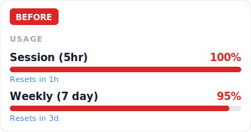
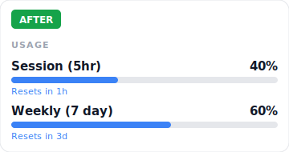

[English](README.md)

# Claude Token Diet

**30번째 메시지는 1번째의 31배 비용이 든다.** 대부분은 이유를 모른다.

Claude Code는 매 메시지마다 전체 대화를 처음부터 다시 읽는다. MCP 도구, rules, 무시 안 된 파일들이 조용히 토큰을 잡아먹는다. 알아챘을 때는 이미 세션이 끝나 있다.

`/token-diet`은 낭비를 찾아서 고치는 과정을 안내한다. **5분이면 된다. 코드 몰라도 된다.**

## Before / After

<p align="center">
  
  &nbsp;&nbsp;&nbsp;&nbsp;
  
</p>

> 같은 작업, 같은 워크플로우. 차이는 `/token-diet` 5분뿐.

## 이런 사람이 써야 한다

- Claude Code 쓰는 **비개발자** (PM, 마케터, 기획자) — 사용량 한도에 걸리는데 원인을 모르는 사람
- 세션을 더 오래 쓰고 싶은 **개발자**
- "Session limit reached"를 너무 일찍 만나본 사람

## 설치 & 실행

```bash
# 1. 클론
git clone https://github.com/jjoa68/claude-token-diet.git
cd claude-token-diet

# 2. 설치
mkdir -p ~/.claude/commands
cp commands/token-diet.md ~/.claude/commands/token-diet.md

# 3. 실행 (아무 Claude Code 세션에서)
/token-diet
```

**끝.** 가이드가 알아서 안내한다 — 진단, 설명, 수정, 반복.

## 뭘 하는 스킬인가 (단계별)

| Step | 소요 시간 | 효과 | 내용 |
|------|-----------|------|------|
| 1 | 30초 | 상 | `/clear`, `/compact` — 가장 많이 아끼는 습관 |
| 2 | 5분 | 상 | 안 쓰는 MCP 도구 정리, `.claudeignore` 생성, CLAUDE.md 강화 |
| 3 | 15분 | 중~상 | `rules/` 분리, Extended Thinking 조절, MCP Tool Search |
| 4 | 30~60분 | 중 | 분산 메모리, 프롬프트 습관, ReadOnce 훅 |

모든 항목은 **왜 해야 하는지** 먼저 설명한다. 아무 항목이나 건너뛸 수 있고, 언제든 중단 가능.

## 부록: `.claudeignore` 템플릿

프로젝트 유형별 즉시 적용 가능한 템플릿:

```bash
cp examples/claudeignore-obsidian /path/to/your/vault/.claudeignore
```

제공 유형: `obsidian` · `nextjs` · `python`

## 부록: ReadOnce 훅

같은 파일을 5분 이내에 다시 읽는 것을 자동 차단한다. 중복 내용이 컨텍스트를 잡아먹는 걸 막는다.

설치 방법은 [`hooks/SETUP.md`](hooks/SETUP.md) 참고.

## 요구사항

[Claude Code](https://docs.anthropic.com/en/docs/claude-code) v1.0.0 이상 (`rules/`, `hooks/`, `/context` 지원 필요)

## 기여하기

이슈와 PR 환영. 변경하고 싶은 내용이 있으면 먼저 이슈를 열어 주세요.

## 라이선스

[MIT](LICENSE)
